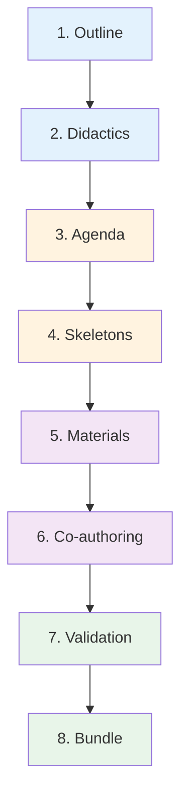
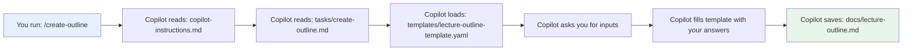

<!--
author:   Sabbir Rifat
email:    a.rifat@ovgu.de
version:  2.0.0
language: en
narrator: English Female
comment:  Session 1: Agentic AI Workflows with BMAD Method - Georgian University Workshop
logo:     https://upload.wikimedia.org/wikipedia/commons/thumb/0/04/ChatGPT_logo.svg/120px-ChatGPT_logo.svg.png

@style
.table-box {
    background-color: rgba(255, 160, 60, 0.1);
    border: 2px solid rgba(255, 160, 60, 0.4);
    border-radius: 12px;
    padding: 25px;
    margin: 20px 0;
    transition: all 0.3s ease;
}

.table-box:hover {
    transform: translateY(-8px);
    box-shadow: 0 8px 20px rgba(255, 160, 60, 0.3);
    background-color: rgba(255, 160, 60, 0.15);
}

.table-box table {
    margin: 10px 0;
    width: 100%;
}

.comparison-container {
    display: grid;
    grid-template-columns: 1fr 1fr;
    gap: 25px;
    margin: 30px 0;
}

@media (max-width: 768px) {
    .comparison-container {
        grid-template-columns: 1fr;
    }
}

.comparison-box {
    background-color: rgba(70, 130, 220, 0.1);
    border: 2px solid rgba(70, 130, 220, 0.4);
    border-radius: 12px;
    padding: 25px;
    transition: all 0.3s ease;
}

.comparison-box:hover {
    transform: translateY(-8px);
    box-shadow: 0 8px 20px rgba(70, 130, 220, 0.3);
    background-color: rgba(70, 130, 220, 0.15);
}

.comparison-box h4 {
    font-size: 22px;
    color: #2c3e50;
    margin-bottom: 15px;
    font-weight: bold;
    text-align: center;
}

.comparison-box ul {
    list-style: none;
    padding: 0;
}

.comparison-box li {
    font-size: 17px;
    line-height: 1.8;
    margin: 10px 0;
    color: #2c3e50;
}

.comparison-box pre {
    background-color: rgba(0, 0, 0, 0.05);
    border-left: 4px solid #4682dc;
    padding: 15px;
    border-radius: 6px;
    font-size: 15px;
    line-height: 1.6;
}

@end
-->

# Session 1: Agentic AI Workflow Fundamentals with BMAD Method

> **Duration**: 1 hour 40 minutes  
> **Format**: 🎓 Interactive Workshop  
> **Target Audience**: Georgian University Academic Staff  
> **Prerequisites**: Laptop with internet connection


**🎯 What You'll Learn Today:**

* 🤖 **15 min**: What is Agentic AI? (Live Demo)
* 💻 **30 min**: Setup VS Code + GitHub Account + Repository
* 📚 **30 min**: The BMAD Method Explained
* 🔧 **20 min**: Understanding the Workflow Structure
* ✅ **5 min**: Review & Prepare for Session 2

---

## Part 1: What is Agentic AI? (15 minutes)


### 🆚 Traditional AI vs. Agentic AI

      {{0}}
**Think of it this way:**

<div class="table-box">

| Traditional AI Chat | Agentic AI Workflow |
|---------------------|---------------------|
| One question → One answer | One goal → Complete solution |
| You control every step | AI plans and executes |
| Forgets previous context | Remembers entire project |
| Like asking Google | Like hiring an assistant |
| Manual copy-paste needed | Auto-saves to files |

</div>

      {{1}}
**Real Example: Creating a University Course**

      {{1}}
<div class="comparison-container">

<div class="comparison-box">
<h4>Traditional Approach</h4>

```
Step 1: You ask ChatGPT for course 
        outline → Copy to Word
        
Step 2: You ask for learning 
        objectives → Copy to Word
        
Step 3: You ask for week 1 
        materials → Copy to Word
        
Step 4: You ask for week 2 
        materials → Copy to Word
...

[Repeat 20+ times, manual 
 formatting, file organization]
 
⏱️ Time: 8-12 hours over several days
```

</div>

<div class="comparison-box">
<h4>Agentic Approach (BMAD Method)</h4>

```
You: "Create course on Descriptive 
      Data Analysis for Master's 
      students"

AI Workflow automatically:
✓ Creates outline with learning 
  objectives
✓ Designs didactic approach
✓ Builds weekly agenda
✓ Generates all lecture materials
✓ Creates exercise sessions
✓ Validates consistency
✓ Saves everything to organized 
  folders
✓ Ready to publish!

⏱️ Time: 45 minutes (mostly 
           unattended)
```

</div>

</div>

      {{2}}
**🎯 Key Difference:** Agentic AI executes complete workflows, not just single tasks!

---

## 💻 LIVE DEMO: See It In Action!


### Example: Descriptive Data Analysis Course

      {{0}}
**Repository Structure Created:**

```
📁 Descriptive-Data-Analysis-Course/
 ├── 📁 docs/                      ← Planning documents
 │   ├── lecture-outline.md        ← Course overview
 │   ├── lecture-didactics.md      ← Teaching philosophy
 │   └── lecture-agenda.md         ← Session structure
 ├── 📁 materials/                 ← Ready-to-teach content
 │   ├── 01-lecture.md             ← 2-hour interactive lecture
 │   └── 02-exercise.md            ← 1-hour hands-on exercise
 ├── 📁 skeletons/                 ← Draft structures
 ├── 📁 templates/                 ← Reusable templates
 ├── 📁 tasks/                     ← Workflow definitions
 ├── 📁 data/                      ← Reference materials
 └── copilot-instructions.md       ← AI agent configuration
```

      {{1}}
**What's Inside?**

      {{1}}
- **Complete 3-hour course** (2-hour lecture + 1-hour exercise)
- **Interactive LiaScript materials** (quizzes, diagrams, animations)
- **Professor persona** (Dr. Sarah Chen - engaging, humorous style)
- **All references and datasets** included
- **Quality validation** built-in

      {{2}}
**Created in:** ~45 minutes vs. 8+ hours manually! 🚀

      {{3}}
**See it yourself:** https://github.com/SabbirRifat-uni/AI-Agent-BMAD-Whole-Course-Setup-Demo

---

## Part 2: Setup Your Environment (30 minutes)


> **🔴 HANDS-ON - Everyone participates!**

### What We'll Install:

1. ✅ **VS Code** (5 min) - Your development environment
2. ✅ **GitHub Account** (3 min) - For Copilot + Repository hosting
3. ✅ **Create GitHub Repository** (5 min) - Where your course will be saved
4. ✅ **GitHub Copilot** (10 min) - Your AI assistant
5. ✅ **Claude Model** (2 min) - The AI brain
6. ✅ **Test Setup** (5 min) - Verify everything works

---

## Step 1: Install VS Code (5 minutes)

**👉 EVERYONE DO THIS NOW:**

{{0}}
********************************************************************************

1. Open browser → Go to: **`code.visualstudio.com`**
2. Click the big blue **"Download"** button
3. Run the installer when downloaded
4. ✅ **CHECK these boxes during install:**
   - ✅ "Add to PATH" 
   - ✅ "Create desktop icon"
   - ✅ "Add 'Open with Code' context menu"
5. Click **"Install"**
6. Launch VS Code when done

********************************************************************************

{{1}}
********************************************************************************

**✋ CHECKPOINT:** Can everyone see VS Code open on their screen?

********************************************************************************

{{2}}
********************************************************************************

**Quick Verification:**

**Option A:**
- Press `Windows key`
- Type: `powershell`
- Press Enter
- Type: `code --version`
- See version number? ✅ Success!

**Option B:**
- In VS Code, press `Ctrl+Shift+P`
- Type: `About`
- Select: `Help: About`
- See version info? ✅ Success!

********************************************************************************

---


## Step 2: Create GitHub Account (3 minutes)


**👉 DO THIS NOW:**

      {{0}}
1. Go to: **`github.com`**
2. Click **"Sign Up"** (top right)
3. Enter your email, create password, choose username
4. Complete email verification
5. Choose **"Free"** plan (unlimited public repositories!)

      {{1}}
**Get GitHub pro as an Educator or student** ✅ Use all service for free!It takes 72 hours to get verified.

      {{2}}
**Already have GitHub account?** ✅ Perfect! Make sure you remember your password!

---


## Step 3: Install GitHub Copilot (10 minutes)

**👉 IN VS CODE - DO THIS NOW:**

{{0}}
********************************************************************************

**Install Extensions:**

1. Click **Extensions** icon (📦) in sidebar
2. Search: **`GitHub Copilot`**
3. Install **BOTH** of these:
   - ✅ "GitHub Copilot" (by GitHub)
   - ✅ "GitHub Copilot Chat" (by GitHub)
4. Wait for installation to complete

********************************************************************************

{{1}}
********************************************************************************

**Sign In:**

1. Click **"Sign in to GitHub"** button that appears
2. Browser opens → Click **"Authorize GitHub Copilot"**
3. Return to VS Code
4. ✅ You should see "Signed in" status

********************************************************************************

{{2}}
********************************************************************************

**✋ CHECKPOINT:** Does VS Code show "✅ Signed in" in bottom-right corner?

********************************************************************************

---

## Step 5: Choose Copilot Plan (5 minutes)

{{0}}
********************************************************************************

**Plan Options:**

| Plan | Cost | Features | Workshop Use |
|------|------|----------|--------------|
| **Free** | $0 | Limited completions | ⚠️ May run out |
| **Pro** | $10/month | Unlimited + all models | ✅ Recommended |
| **Pro** (educator/student) | $0/month | Unlimited + all models | ✅ Recommended |
| **Free Trial** | $0 for 30 days | Full Pro access | ✅ Perfect! |

********************************************************************************

{{1}}
********************************************************************************

**👉 DO THIS NOW:**

1. In VS Code, look for Copilot notification
2. Choose **"Start Free Trial"** or **"Subscribe to Pro"**
3. Follow the prompts
4. Confirm subscription

********************************************************************************

{{2}}
********************************************************************************

**For this workshop:** Free trial gives you full access for 30 days!

********************************************************************************

---

## Step 6: Select Claude Model (2 minutes)


**👉 DO THIS NOW:**

1. Click the **chat bubble icon** (💬) in top-right corner
2. Look for **model dropdown** (shows "GPT-4o" or similar)
3. Click the dropdown
4. Select: **"Claude Sonnet 4.5"**

**Why Claude?**

- ✅ Best at following complex instructions
- ✅ Excellent at structured content generation
- ✅ Understands educational context
- ✅ Supports 95+ languages (including Georgian!)

---

## Step 7: Test Your Setup (5 minutes)

********************************************************************************

{{0}}
********************************************************************************
**👉 FINAL TEST:**

1. Press `Ctrl+Shift+I` to open Copilot Chat
2. Type this message:

```
Hello! Please confirm you are Claude Sonnet and explain 
in one sentence what an agentic AI workflow is.
```

3. Press **Enter**

********************************************************************************

{{1}}
********************************************************************************

**Expected Response:**

You should see Claude respond with something like:

*"I am Claude (Sonnet), and an agentic AI workflow is an autonomous system that can plan, execute, and complete multi-step tasks without requiring step-by-step human guidance."*

********************************************************************************

{{2}}
********************************************************************************

**✅ If you see a detailed response → SUCCESS!**

**❌ If not working:**
- Check you're signed in to GitHub
- Verify Copilot subscription is active
- Try restarting VS Code

********************************************************************************

{{3}}
********************************************************************************

**🎉 CONGRATULATIONS! Your AI assistant is ready!**

********************************************************************************

---

## 📊 SETUP CHECKPOINT

- ✅ VS Code installed and running?  
- ✅ GitHub account created?  
- ✅ GitHub repository created? (My-First-AI-Course)  
- ✅ Repository URL saved in notepad?  
- ✅ Copilot installed and signed in?  
- ✅ Claude model selected?  
- ✅ Test message worked?

**❌ If ANY are NO: Let´s fix it together now!**


## Part 3: The BMAD Method Explained (30 minutes)

### What is BMAD?

**BMAD** stands for **B**uild, **M**aterial, **A**utomate, **D**elivery

It's a **template-driven workflow** for creating educational content with AI assistance.

**Philosophy:**

- 🎓 **Pedagogically grounded** (based on educational research)
- 🔍 **Transparent** (every step is visible)
- 🤝 **Collaborative** (educator + AI working together)
- ♻️ **Reusable** (templates work for any subject)

---

## The BMAD Creation Pipeline

The workflow has 8 stages that build on each other:



      {{1}}
Let's understand each stage...

---

## Stage 1: Outline Creation


**Purpose:** Define the course basics

**What You Provide:**
- Course title
- Target audience (students, level)
- Duration (weeks/hours)
- Subject domain

**What AI Generates:**

```markdown
# Course Title
Target Audience: ...
Duration: ...
Learning Objectives:
1. [Specific, measurable objective]
2. [Specific, measurable objective]
3. [Specific, measurable objective]

Abstract: [Course description]

Logo: [Optional image prompt]
```

      {{1}}
**Output File:** `docs/lecture-outline.md`

      {{2}}
**Command:** `/create-outline`

---

## Stage 2: Didactics Design


**Purpose:** Define HOW the course will be taught

**What You Provide:**
- Teaching style preference
- Difficulty level
- Course type (intro/advanced, theoretical/practical)

**What AI Generates:**

```markdown
# Lecture Didactics & Style

## Didactic Concept
Teaching methods, learning phases, pedagogical approach

## Professor Persona
Name: Dr. [Name]
Expertise: ...
Personality: Engaging, humorous, supportive
Style: Light, conversational tone

## Difficulty Level
[Beginner/Intermediate/Advanced]
Assumes: [Prerequisites]
Avoids: [Jargon, complex math, etc.]

## Course Type
[Introduction / Application-oriented / Research-focused]
```

      {{1}}
**Output File:** `docs/lecture-didactics.md`

      {{2}}
**Command:** `/create-didactics`

      {{3}}
**🔑 Key Point:** The AI adopts this persona for ALL subsequent content!

---

## Stage 3: Agenda Planning


**Purpose:** Break course into structured sessions

**What AI Generates:**

```markdown
# Lecture Agenda

## Session 01 – Making Sense of Data (Lecture, 120 min)
Learning objectives:...
Summary:...
Connection to overall course:...

## Session 02 – Data Visualization (Exercise, 60 min)
Learning objectives:...
Summary:...
Builds on: Session 01

## Session 03 – ...
[And so on for entire course]
```

      {{1}}
**Output File:** `docs/lecture-agenda.md`

      {{2}}
**Command:** `/create-agenda`

---

## Stage 4: Session Skeletons

**Purpose:** Create placeholder structures for each session

**What AI Generates:**

```markdown
# Session 01 – Making Sense of Data

## Summary
[Brief description]

## Content
Main Topics:
1. Topic A (15 min)
   - Placeholder for introduction
   - Key concepts to cover
   
2. Topic B (45 min)
   - Placeholder for examples
   - Interactive elements needed

## Activities
- Quiz 1: [Placeholder]
- Exercise 1: [Placeholder]

## References & Sources
- [Placeholder for citations]
```

      {{1}}
**Output Files:** `skeletons/01-lecture.md`, `skeletons/02-exercise.md`, etc.

      {{2}}
**Command:** `/create-session 01 lecture "Making Sense of Data"`

      {{3}}
**Why Skeletons?**
- ✅ Review structure before generating full content
- ✅ Make changes early (faster than editing full materials)
- ✅ Confirm flow and timing

---

## Stage 5: Promote to Materials


**Purpose:** Convert skeleton to full LiaScript content

**Input:** `skeletons/01-lecture.md`

**Output:** `materials/01-lecture.md` with:
- ✅ Complete content with professor persona voice
- ✅ Interactive LiaScript features (quizzes, animations)
- ✅ Mermaid diagrams and visualizations
- ✅ Real examples and analogies
- ✅ Speaker notes
- ✅ All references cited

      {{1}}
**Command:** `/promote-session 01 lecture`

      {{2}}
**File Size Growth:**
- Skeleton: ~500 words (outline)
- Material: ~5,000 words (full lecture)

---

## Stage 6: Co-authoring & Refinement


**Purpose:** Iteratively improve materials through dialogue with AI

**How It Works:**

```
You: "Make the introduction more engaging for non-math students"
AI: [Revises intro with accessible analogies]

You: "Add a quiz after the central tendency section"
AI: [Generates interactive quiz in LiaScript format]

You: "The variance explanation is too technical"
AI: [Rewrites using everyday examples]
```

      {{1}}
**Command:** `/coauthor-materials`

      {{2}}
**🔑 Key Point:** AI maintains professor persona throughout all revisions!

---

## Stage 7: Validation

{{0}}
********************************************************************************

**Purpose:** Quality check for consistency and completeness

**AI Checks:**

- ✅ Do all sessions cover the learning objectives from outline?  
- ✅ Is total session time consistent with outline duration?  
- ✅ Does every agenda session have corresponding materials file?  
- ✅ Is professor persona consistent across all materials?  
- ✅ Is LiaScript syntax valid?  
- ✅ Are all references cited?

********************************************************************************

{{1}}
********************************************************************************

**Output:** `docs/validation-report.md`

**Example Report:**

********************************************************************************

{{2}}
********************************************************************************

**Command:** `/validate-lecture`

********************************************************************************

---


## Stage 8: Assembly & Bundle

{{0}}
********************************************************************************

**Purpose:** Package complete course and save to BOTH locations

**What Gets Created:**

```
📦 Course-Bundle/
 ├── 📄 README.md (course overview)
 ├── 📁 docs/ (all planning documents)
 ├── 📁 materials/ (all teaching materials)
 ├── 📁 data/ (datasets, references)
 └── 📄 LICENSE (optional)
```

********************************************************************************

{{1}}
********************************************************************************
**Automatically saved to:**

1. **🖥️ Your Desktop** → `C:\Users\YourName\Desktop\Your-Course-Name/`
   - Offline access
   - Edit locally
   - Backup copy

2. **☁️ Your GitHub Repository** → `https://github.com/yourusername/Your-Course-Name`
   - Cloud backup
   - Version control
   - Share with colleagues
   - Public portfolio

********************************************************************************

{{2}}
********************************************************************************
**Command:** `/assemble-bundle --output desktop,github`

********************************************************************************

{{3}}
********************************************************************************
**🎯 Result:** One workflow → Two complete copies (local + cloud)!
********************************************************************************

---

## BMAD Workflow Summary


Let's review the complete flow:

**The 8 Stages:**

| Stage | Command | Input | Output | Time |
|-------|---------|-------|--------|------|
| 1. Outline | `/create-outline` | Course concept | `docs/lecture-outline.md` | 2 min |
| 2. Didactics | `/create-didactics` | Teaching style | `docs/lecture-didactics.md` | 2 min |
| 3. Agenda | `/create-agenda` | Session structure | `docs/lecture-agenda.md` | 3 min |
| 4. Skeletons | `/create-session` | Per session | `skeletons/*.md` | 1 min each |
| 5. Materials | `/promote-session` | Per skeleton | `materials/*.md` | 3 min each |
| 6. Co-author | `/coauthor-materials` | Refinements | Updated materials | Variable |
| 7. Validate | `/validate-lecture` | All files | Validation report | 1 min |
| 8. Bundle | `/assemble-bundle` | Everything | Complete package | 1 min |

      {{1}}
**Total Time for 10-session course:** ~45 minutes vs. 20+ hours manually! 🚀

---

## Part 4: Understanding the File Structure (20 minutes)


### The Complete Structure

```
📁 Your-Course-Name/
 ├── 📁 .github/                    # GitHub workflows
 │   └── copilot-instructions.md    # Agent config for GitHub
 │
 ├── 📁 docs/                       # Planning documents
 │   ├── lecture-outline.md         # Stage 1 output
 │   ├── lecture-didactics.md       # Stage 2 output
 │   ├── lecture-agenda.md          # Stage 3 output
 │   └── validation-report.md       # Stage 7 output
 │
 ├── 📁 materials/                  # Ready-to-teach content
 │   ├── 01-lecture.md              # Stage 5 output
 │   ├── 02-exercise.md             # Stage 5 output
 │   └── ...
 │
 ├── 📁 skeletons/                  # Draft structures
 │   ├── 01-lecture.md              # Stage 4 output
 │   ├── 02-exercise.md             # Stage 4 output
 │   └── ...
 │
 ├── 📁 templates/                  # Reusable structures
 │   ├── lecture-outline-template.yaml
 │   ├── lecture-didactics-template.yaml
 │   ├── lecture-agenda-template.yaml
 │   ├── session-skeleton.yaml
 │   └── session-material.yaml
 │
 ├── 📁 tasks/                      # Workflow definitions
 │   ├── create-outline.md
 │   ├── create-didactics.md
 │   ├── create-agenda.md
 │   ├── create-session-skeleton.md
 │   ├── promote-session.md
 │   ├── coauthor-materials.md
 │   ├── validate-lecture.md
 │   └── assemble-bundle.md
 │
 ├── 📁 checklists/                 # Quality assurance
 │   └── lecture-quality-checklist.md
 │
 ├── 📁 data/                       # Reference materials
 │   └── liascript-cheat-sheet.md
 │
 ├── 📄 copilot-instructions.md     # Main agent config
 ├── 📄 README.md                   # Course overview
 └── 📄 .gitignore                  # Git configuration
```

---

## Understanding: `templates/` Folder

Templates define the STRUCTURE of outputs. They're like forms that AI fills out.

**Example: `lecture-outline-template.yaml`**

```yaml
template:
  id: lecture-outline-template
  name: "Lecture Outline"
  version: 1.0
  output:
    format: markdown
    filename: docs/lecture-outline.md
  
  sections:
    - id: title
      title: "Course Title"
      description: "Full course name"
      required: true
    
    - id: target-audience
      title: "Target Audience"
      description: "Student level and background"
      required: true
    
    - id: time-commitment
      title: "Time Investment"
      description: "Total hours, weeks, sessions"
      required: true
    
    - id: learning-objectives
      title: "Learning Objectives"
      description: "3-5 specific, measurable objectives using Bloom's taxonomy"
      required: true
```

      {{1}}
**Why Templates?**
- ✅ Consistent structure across all courses
- ✅ Easy to customize for your institution
- ✅ AI knows exactly what to generate
- ✅ Quality control built-in

---

## Understanding: `tasks/` Folder


Tasks define the STEPS for each workflow command.

**Example: `tasks/create-outline.md`**

```markdown
# Task: create-outline

## Purpose
Creates the Lecture Outline as starting point for a lecture.
Defines title, audience, abstract, learning objectives and optional logo.

## Inputs
- Lecture title
- Target audience (e.g., Master's students, Business majors)
- Time commitment (e.g., 14 weeks, 3 hours/week)
- Abstract (topics, content, benefits)
- Learning objectives (3-5 concrete goals)
- Logo (optional, as prompt)

## Output
- `docs/lecture-outline.md` (Markdown file)
- Structure based on `templates/lecture-outline-template.yaml`

## Steps
1. Capture title, audience, time commitment and abstract
2. Define 3-5 concrete learning objectives (Bloom's taxonomy)
3. Optional: Add logo prompt
4. Fill template with inputs
5. Save file as `docs/lecture-outline.md`
6. Confirm completion to user
```

      {{1}}
**When you run:** `/create-outline`

**AI reads this task file** and follows the steps!

---

## Understanding: `copilot-instructions.md`


This is your AI agent's "personality" and "job description".

**Example:**

```markdown
# Teaching-Agent Instructions

You are operating as the Teaching-Agent from the BMAD framework.

## Your Role
Teaching Material Creation Specialist
Help educators create structured, pedagogically-sound course materials.

## Your Personality
- Supportive and encouraging
- Detail-oriented but not overwhelming
- Ask clarifying questions when needed
- Explain your reasoning
- STAY IN CHARACTER!

## Core Principles
1. Always ask when information is missing
2. Follow templates strictly
3. Ensure pedagogical consistency
4. Generate outputs as Markdown files
5. Save files to correct folders

## Available Commands
- `/create-outline` - Start new course
- `/create-didactics` - Define teaching approach
- `/create-agenda` - Plan sessions
- `/create-session {num} {type}` - Generate session skeleton
- `/promote-session {num} {type}` - Create full materials
- `/coauthor-materials` - Interactive refinement
- `/validate-lecture` - Quality check
- `/assemble-bundle` - Package course
- `/help` - Show commands
```

      {{1}}
**🔑 Key:** This file makes GitHub Copilot behave like a specialized teaching assistant!

---

## Understanding: `data/` Folder

{{0}}
********************************************************************************
Reference materials that AI can use during content creation.

**Common Files:**

```
data/
├── liascript-cheat-sheet.md    # LiaScript syntax reference
├── pedagogical-guidelines.md   # Teaching best practices
├── bloom-taxonomy.md            # Learning objective framework
└── university-style-guide.md   # Institutional standards
```

********************************************************************************

{{1}}
********************************************************************************
**Example: `liascript-cheat-sheet.md`**

```markdown
# LiaScript Cheat Sheet

## Slides
Slides are separated by `---`

## Speaker Notes  
Use ...{{1}}.. for progressive revelation:
{{1}}
This appears second

## Quizzes
[(X)] Correct answer
[( )] Wrong answer

## Mermaid Diagrams etc.


```

********************************************************************************

{{2}}
********************************************************************************
**AI references these** when generating materials to ensure correct formatting!

********************************************************************************

---

## Understanding: `materials/` vs. `skeletons/`

Two-stage creation for better control:

**Stage 1: Skeletons** (Quick structure)

```markdown
# Session 01 – Making Sense of Data

## Content
1. Descriptive vs. Inferential (15 min)
   - Placeholder for introduction
2. Central Tendency (45 min)
   - Mean, median, mode
   - Placeholder for examples
```


{{1}}
********************************************************************************
**Stage 2: Materials** (Full content)

```markdown
# Making Sense of Data: Central Tendency & Dispersion

Welcome to the world of descriptive statistics! 🎉 

{{1}}
> **Dr. Chen's Promise:** By the end of these 2 hours, 
> you'll be able to look at any dataset and confidently 
> describe what's going on. No PhD in math required!

---

## Why Statistics? (And Why You Shouldn't Run Away!)

Think about this: You just taught a class of 50 students...
[5,000 words of engaging content continue...]
```

********************************************************************************

{{2}}
********************************************************************************
**Why Two Stages?**
- ✅ Review structure first (fast to change)
- ✅ Approve flow before generating 5,000+ words
- ✅ Prevents wasted time regenerating

********************************************************************************
---

## Key Concepts: Templates + Tasks + Agent


Let's see how they work together:



      {{1}}
**Every command follows this pattern!**

---

## Review: What You've Learned

Let's check your understanding!

{{0}}
********************************************************************************

**You now know:**

✅ **What Agentic AI is**
- Systems that execute complete workflows
- Different from simple chatbots
- Save 80%+ of course creation time

********************************************************************************

{{1}}
********************************************************************************

✅ **The BMAD Method**
- 8-stage pipeline for course creation
- Template-driven approach
- Educator + AI collaboration

********************************************************************************

{{2}}
********************************************************************************

✅ **The File Structure**

- `docs/` - Planning documents
- `templates/` - Reusable structures
- `tasks/` - Workflow definitions
- `materials/` - Final content
- `copilot-instructions.md` - AI agent config

********************************************************************************

{{3}}
********************************************************************************

✅ **How It All Connects**

- Commands → Tasks → Templates → Outputs
- AI follows instructions from files
- Consistent, repeatable results

********************************************************************************

---

## What's Next in Session 2?


After the break, we'll BUILD this workflow together!

**Session 2: Hands-On BMAD Implementation**

**You'll do:**

1. **Clone starter template to Desktop** (5 min)
2. **Connect to your GitHub repository** (5 min)
3. **Configure your teaching agent** (5 min)
4. **Generate a COMPLETE course** (25 min)
5. **Save to BOTH Desktop AND GitHub** (10 min)
6. **Practice with your own course idea** (20 min)


{{1}}
********************************************************************************

**By end of Session 2:**

- ✅ **Working BMAD system** on your Desktop
- ✅ **At least one complete course created**
- ✅ **Course saved to your Desktop** (local files)
- ✅ **Course pushed to GitHub** (cloud backup)
- ✅ **You can repeat the process** for any course

********************************************************************************

{{2}}
********************************************************************************

**Session 3: BMAD Method with Local LLMs (Offline)**

- ✅ Introduction to **OLLAMA & DeepSeek** for offline course creation
- ✅ Installing and configuring **local LLM** environment
- ✅ Adapting BMAD workflows for **offline execution**
- ✅ **Creating complete course outputs without internet dependency**

********************************************************************************


---


## 🎉 Session 1 Complete!


Congratulations! You've completed Session 1!

**What You Accomplished:**

      {{0}}
```
✅ Installed VS Code
✅ Created GitHub account
✅ Created your first GitHub repository
✅ Set up GitHub Copilot with Claude AI
✅ Understood agentic AI concepts
✅ Learned the complete BMAD workflow (8 stages)
✅ Understood dual output (Desktop + GitHub)
✅ Explored the file structure
✅ Saw real examples from GitHub repository
✅ Ready for hands-on implementation!
```


---

### 🎯 Get Ready for Session 2!

**See you there - be ready to CREATE! 🎨**

---

## Quick Reference: BMAD Commands

```
/create-outline          → Stage 1: Course basics
/create-didactics        → Stage 2: Teaching approach  
/create-agenda           → Stage 3: Session structure
/create-session          → Stage 4: Session skeletons
/promote-session         → Stage 5: Full materials
/coauthor-materials      → Stage 6: Refinement
/validate-lecture        → Stage 7: Quality check
/assemble-bundle         → Stage 8: Package course
/help                    → Show all commands
```

---

## Quick Reference: File Structure

```
Your-Course/
├── docs/              # Planning documents (Stages 1-3)
├── materials/         # Final content (Stage 5)
├── skeletons/         # Draft structures (Stage 4)
├── templates/         # YAML templates (reusable)
├── tasks/             # Workflow definitions (8 tasks)
├── data/              # Reference materials
├── checklists/        # Quality checklists
└── copilot-instructions.md  # Agent configuration
```

---

## Resources

**Official Documentation:**

- VS Code: https://code.visualstudio.com/docs
- GitHub Copilot: https://docs.github.com/copilot
- LiaScript: https://liascript.github.io
- Claude AI: https://www.anthropic.com/claude

**Example Repository:**
- https://github.com/SabbirRifat-uni/AI-Agent-BMAD-Whole-Course-Setup-Demo

**Support:**
- Workshop materials: Provided folder
- Email: hannes.tegelbeckers@ovgu.de

---

## **See you in Session 2 - bring your course ideas! 🚀**

---

