<!--
author:   Sabbir Rifat
email:    a.rifat@ovgu.de
version:  2.0.0
language: en
narrator: English Female
comment:  Session 2: BMAD Hands-On Implementation - Georgian University Workshop
logo:     https://upload.wikimedia.org/wikipedia/commons/thumb/0/04/ChatGPT_logo.svg/120px-ChatGPT_logo.svg.png

@style
.info-box {
    background-color: rgba(70, 130, 220, 0.1);
    border: 2px solid rgba(70, 130, 220, 0.4);
    border-radius: 12px;
    padding: 25px;
    margin: 20px 0;
    transition: all 0.3s ease;
}

.info-box:hover {
    transform: translateY(-8px);
    box-shadow: 0 8px 20px rgba(70, 130, 220, 0.3);
    background-color: rgba(70, 130, 220, 0.15);
}

.success-box {
    background-color: rgba(76, 175, 80, 0.1);
    border: 2px solid rgba(76, 175, 80, 0.4);
    border-radius: 12px;
    padding: 25px;
    margin: 20px 0;
    transition: all 0.3s ease;
}

.success-box:hover {
    transform: translateY(-8px);
    box-shadow: 0 8px 20px rgba(76, 175, 80, 0.3);
    background-color: rgba(76, 175, 80, 0.15);
}

.warning-box {
    background-color: rgba(255, 160, 60, 0.1);
    border: 2px solid rgba(255, 160, 60, 0.4);
    border-radius: 12px;
    padding: 25px;
    margin: 20px 0;
    transition: all 0.3s ease;
}

.warning-box:hover {
    transform: translateY(-8px);
    box-shadow: 0 8px 20px rgba(255, 160, 60, 0.3);
    background-color: rgba(255, 160, 60, 0.15);
}

.step-container {
    display: grid;
    grid-template-columns: 1fr;
    gap: 20px;
    margin: 25px 0;
}

.step-box {
    background-color: rgba(156, 39, 176, 0.1);
    border-left: 5px solid rgba(156, 39, 176, 0.6);
    border-radius: 8px;
    padding: 20px;
    transition: all 0.3s ease;
}

.step-box:hover {
    transform: translateX(10px);
    box-shadow: 0 6px 15px rgba(156, 39, 176, 0.2);
    background-color: rgba(156, 39, 176, 0.15);
}

.step-box h4 {
    font-size: 20px;
    color: #7b1fa2;
    margin-bottom: 12px;
    font-weight: bold;
}

.code-output {
    background-color: rgba(0, 0, 0, 0.05);
    border-left: 4px solid #4682dc;
    padding: 15px;
    border-radius: 6px;
    font-family: 'Courier New', monospace;
    font-size: 14px;
    margin: 15px 0;
}

@end
-->

# Session 2: BMAD Hands-On Implementation

> **Duration**: 1 hour 40 minutes  
> **Format**: 🎓 Hands-On Workshop  
> **Target Audience**: Georgian University Academic Staff  
> **Prerequisites**: Session 1 completed (VS Code + GitHub + Copilot setup)

Welcome to Session 2! Today we'll create a complete university course together using the BMAD Method. Everyone will create the same course: "AI in TVET" (Artificial Intelligence in Technical and Vocational Education and Training). By the end, you'll have a complete 2-hour course saved to both GitHub and your local computer!

**🎯 What We'll Build Together:**

* 🌐 **10 min**: Create GitHub Repository First
* 💻 **10 min**: Clone to Your Local Computer
* 🔗 **5 min**: Connect Local & GitHub for Live Sync
* 🚀 **60 min**: Generate Complete "AI in TVET" Course (Everyone Together)
* ✅ **15 min**: Verify & Push Final Changes


---

## Quick Recap: Session 1 (2 minutes)

Let's quickly review what we set up last session:

### What You Already Have:

      {{0}}
<div class="success-box">

**✅ Your Setup Checklist:**

- VS Code installed and running
- GitHub account created
- GitHub Copilot + Claude AI configured
- Understanding of BMAD Method (8 stages)
- Ready to create courses!

</div>

      {{1}}
**The Course We'll Create Today:**

<div class="info-box">

**📚 Course: AI in TVET**  
**Target:** Master's Students  
**Duration:** 2-hour session  
**Method:** BMAD 8-stage workflow

**Topics Covered:**
- AI fundamentals for TVET educators
- Practical AI tools for vocational training
- AI integration in technical education
- Hands-on applications


      {{2}}
**🎯 Today's Goal:** Everyone creates the same "AI in TVET" course together, saved to GitHub AND local computer!

    style H fill:#e8f5e9
```

</div>

      {{2}}

**🎯 Today's Goal:** Run all 8 stages and get a complete course!


---

## Part 1: Create GitHub Repository FIRST (10 minutes)

We'll start by creating a repository on GitHub. This will be the cloud home for your "AI in TVET" course.

### Step 1: Create New Repository

      {{0}}
**👉 IN BROWSER - EVERYONE DO THIS:**

<div class="step-container">

<div class="step-box">
<h4>Go to GitHub</h4>

1. Open browser → Go to: **`github.com`**
2. Make sure you're logged in
3. Click **"+"** button (top right corner)
4. Select **"New repository"**

</div>

<div class="step-box">
<h4>Configure Repository</h4>

Fill in these details EXACTLY:

- **Repository name:** `AI-in-TVET-Course`
- **Description:** `Complete AI in TVET course for Master's students - Created with BMAD Method`
- **Visibility:** ✅ **Public** (so you can share it!)
- **Initialize repository with:**
  - ✅ **CHECK** "Add a README file"
  - ✅ **CHECK** "Add .gitignore" → Choose template: **None**
  - ❌ **UNCHECK** "Choose a license" (optional)

</div>

<div class="step-box">
<h4>Create Repository</h4>

- Click green **"Create repository"** button at bottom
- Wait for GitHub to create it

</div>

</div>

      {{1}}
<div class="success-box">

**✋ CHECKPOINT:** Do you see your new repository page with:

- Repository name: `AI-in-TVET-Course`
- A README.md file listed
- Green "Code" button visible

**✅ If yes → Excellent! Copy the repository URL now!**

</div>

### Step 2: Copy Repository URL

<div class="warning-box">

**📋 IMPORTANT - Copy Your Repository URL:**

1. Click the green **"Code"** button
2. Make sure **"HTTPS"** tab is selected
3. Click the **copy icon** 📋 next to the URL
4. Your URL looks like: `https://github.com/YourUsername/AI-in-TVET-Course.git`

**Paste it in Notepad** - you'll need it in the next step!

</div>

---

## Part 2: Clone Repository to Your Computer (10 minutes)

Now we'll download (clone) the repository from GitHub to your local computer so you can work on it.

### Step 1: Open VS Code Terminal

      {{0}}
**👉 IN VS CODE:**

<div class="step-box">
<h4>Open Terminal in VS Code</h4>

1. Open **VS Code**

2. Click Terminal in the top menu

3. Select New Terminal

4. Terminal panel appears at bottom of VS Code

**Make sure it says "powershell" in the dropdown**

</div>


### Step 2: Navigate to Desktop

<div class="step-box">
<h4>Go to Desktop Folder</h4>

Type this command in terminal:

```powershell
cd $env:USERPROFILE\Desktop
```

Press **Enter**

</div>

<div class="code-output">

**Expected output:**
```
PS C:\Users\YourName\Desktop>
```

✅ You're now in the Desktop folder!

</div>

### Step 3: Clone the Repository

<div class="step-box">
<h4>Clone from GitHub to Local Computer</h4>

Type this command, **but replace with YOUR repository URL:**

```powershell
git clone https://github.com/YourUsername/AI-in-TVET-Course.git
```

**Example:**

```powershell
git clone https://github.com/sarah.chen/AI-in-TVET-Course.git
```

Press **Enter**

</div>

      {{1}}
<div class="code-output">

**Expected Output:**

```
Cloning into 'AI-in-TVET-Course'...
remote: Enumerating objects: 3, done.
remote: Counting objects: 100% (3/3), done.
remote: Total 3 (delta 0), reused 0 (delta 0)
Receiving objects: 100% (3/3), done.
```

</div>

      {{2}}
<div class="success-box">

**✅ CHECKPOINT:** 

Look at your Desktop - do you see a new folder named **`AI-in-TVET-Course`**?

**If yes → Perfect! Continue to next step!**

</div>

---

## Part 3: Open Repository & Add BMAD Template (5 minutes)

Now we'll open this folder in VS Code and add the BMAD template files to it.

### Step 1: Open the Folder

**👉 IN VS CODE:**

<div class="step-box">
<h4>Open Your Course Folder</h4>

1. Click **File** → **Open Folder...**
2. Navigate to **Desktop**
3. Select the **`AI-in-TVET-Course`** folder
4. Click **"Select Folder"**
5. If prompted "Do you trust the authors?" → Click **"Yes, I trust"**

</div>

### Step 2: Download BMAD Template Files

<div class="step-box">
<h4>Get BMAD Template</h4>

1. Open new browser tab
2. Go to: `https://github.com/SabbirRifat-uni/AI-Agent-BMAD-Whole-Course-Setup-Demo`
3. Click green **"Code"** button → **"Download ZIP"**
4. Save to Desktop
5. **Extract** the ZIP file
6. Open the extracted folder

</div>

### Step 3: Copy Template Files to Your Repository

<div class="step-box">
<h4>Copy All Template Files</h4>

1. In the extracted **BMAD template folder**, select ALL folders:

   - 📁 `docs/`
   - 📁 `materials/`
   - 📁 `skeletons/`
   - 📁 `templates/`
   - 📁 `tasks/`
   - 📁 `data/`
   - 📁 `checklists/`
   - 📄 `copilot-instructions.md`

2. **Copy** them (Ctrl+C)
3. Go to your **`AI-in-TVET-Course`** folder on Desktop
4. **Paste** them (Ctrl+V)

</div>

      {{1}}
<div class="info-box">

**✋ CHECKPOINT:** In VS Code sidebar, you should now see:

```
📁 AI-in-TVET-Course/
 ├── 📁 checklists/
 ├── 📁 data/
 ├── 📁 docs/
 ├── 📁 materials/
 ├── 📁 skeletons/
 ├── 📁 tasks/
 ├── 📁 templates/
 ├── 📄 copilot-instructions.md
 └── 📄 README.md
```

</div>

### Step 4: Commit & Push to GitHub

<div class="step-box">
<h4>Save Changes to GitHub</h4>

In VS Code terminal, type these commands one by one:

```powershell
git add .
git commit -m "Add BMAD template files"
git push
```

</div>

      {{1}}
<div class="code-output">

**Expected Output:**

```
[main abc1234] Add BMAD template files
 45 files changed, 2500 insertions(+)
Enumerating objects: 50, done.
Writing objects: 100% (50/50), done.
To https://github.com/YourUsername/AI-in-TVET-Course.git
   abc1234..def5678  main -> main
```

</div>

      {{2}}
<div class="success-box">

**✅ SUCCESS!** Your BMAD template is now:
- ✅ On your local computer (Desktop folder)
- ✅ Synced to GitHub repository
- ✅ Ready for live connection!

**Verify:** Refresh your GitHub repository page - you should see all the new folders!

</div>

      {{3}}
<div class="success-box">

**✅ Success:** Folder `BMAD-Template` created on Desktop!

</div>

---

## Part 4: Open Template in VS Code (5 minutes)

Now let's open the template folder so VS Code can access all the files.

      {{0}}
**👉 DO THIS NOW:**

<div class="step-box">
<h4>Opening Your Template Folder:</h4>

1. In VS Code, click **File** → **Open Folder...**
2. Navigate to Desktop → Select `AI-in-TVET-Course` folder
3. Click **"Select Folder"**
4. **If prompted:** "Do you trust the authors?" → Click **"Yes, I trust"**

</div>

      {{1}}
<div class="info-box">

**✋ CHECKPOINT:** Can you see the folder structure in the left sidebar?

```
📁 BMAD-Template/
 ├── 📁 docs/
 ├── 📁 materials/
 ├── 📁 skeletons/
 ├── 📁 templates/
 ├── 📁 tasks/
 ├── 📁 data/
 ├── 📁 checklists/
 └── 📄 copilot-instructions.md
```

</div>

      {{2}}
<div class="success-box">

**✅ If you see this structure → SUCCESS!**

You're ready to proceed to GitHub connection!

</div>

---

## Part 5: Connect to Your GitHub Repository (10 minutes)

Now we'll connect this local folder to YOUR GitHub repository so files automatically sync to the cloud.

### Step 1: Initialize Git

      {{0}}
**👉 IN VS CODE TERMINAL:**

<div class="step-box">
<h4>Initialize Git Repository:</h4>

Open new terminal in VS code, then type:

```powershell
git init
```

</div>

      {{1}}
<div class="code-output">

**Expected Output:**
```
Initialized empty Git repository in C:/Users/YourName/Desktop/BMAD-Template/.git/
```

</div>


---

### Step 2: Configure Your Identity

Tell Git who you are (needed for commits):

      {{0}}
**👉 TYPE THESE COMMANDS:**

<div class="step-box">
<h4>Set Your Git Identity:</h4>

**Replace with YOUR information:**

```powershell
git config user.name "Your Name"
git config user.email "your.email@university.edu"
```

**Example:**
```powershell
git config user.name "Dr. Sarah Chen"
git config user.email "s.chen@georgian.edu"
```

</div>

      {{1}}
<div class="info-box">

**Verify it worked:**

```powershell
git config user.name
git config user.email
```

✅ Should show your name and email!

</div>

---


## Part 6: Meet Your AI Teaching Agent (5 minutes)

Let's activate and test the Teaching Agent that will help you create courses.

---

### Understanding the Agent

      {{0}}
**Open this file:** `copilot-instructions.md`

Click on it in the left sidebar.

**This file tells GitHub Copilot:**
- ✅ How to behave (supportive, educational)
- ✅ What commands to recognize (`/create-outline`, etc.)
- ✅ What templates to use
- ✅ Where to save files

---

      {{1}}
**You don't need to edit this file!** It's pre-configured.

---

### Test the Agent

Let's make sure Copilot can read the instructions:

---

      {{1}}
<div style="background-color: rgba(33, 150, 243, 0.1); border-left: 4px solid #2196F3; padding: 15px; margin: 10px 0; border-radius: 4px;">

**👉 DO THIS NOW:**

1. Press `Ctrl+Shift+I` to open Copilot Chat

2. Type this message:
```
@workspace Hello! Can you confirm you're ready to help 
me create course materials using the BMAD Method? 
What commands are available?
```

3. Press Enter

</div>

---

      {{2}}
<div style="background-color: rgba(156, 39, 176, 0.1); border-left: 4px solid #9C27B0; padding: 15px; margin: 10px 0; border-radius: 4px;">

**Expected Response:**

Claude should respond with something like:

*"Yes, I'm ready to assist you with the BMAD Method! I can see the workspace structure with templates, tasks, and configuration. Available commands include: /create-outline, /create-didactics, /create-agenda, /create-session, /promote-session, /coauthor-materials, /validate-lecture, /assemble-bundle, and /help for more details."*

</div>

      {{3}}
<div style="background-color: rgba(255, 152, 0, 0.1); border-left: 4px solid #FF9800; padding: 15px; margin: 10px 0; border-radius: 4px;">

**✅ If you get a response listing commands → AGENT IS READY!**

**❌ If not working:**
- Make sure you have the folder open in VS Code
- Check that `copilot-instructions.md` file exists
- Try restarting VS Code

</div>

---

## Part 7: Create "AI in TVET" Course Together (45 minutes)

Now for the exciting part! We'll create a complete course **together** using a comprehensive megaprompt that executes the entire BMAD workflow in one go!

### Our Course: "Artificial Intelligence in Technical and Vocational Education and Training"

      {{0}}
<div class="info-box">

**📚 Course Specifications:**

- **Title:** Artificial Intelligence in Technical and Vocational Education and Training
- **Target Audience:** Master's students in Education/Pedagogy
- **Duration:** 2-hour intensive session
- **Format:** Interactive lecture with practical demonstrations
- **Topics:** AI fundamentals, applications in TVET, ethical considerations, hands-on tools

</div>

      {{1}}
<div class="success-box">

**✅ Everyone creates the SAME course together!**

This way we can:
- Follow along step-by-step
- Compare results
- Troubleshoot together
- Learn the complete workflow

</div>

---

### The BMAD Megaprompt Approach

      {{0}}
<div class="warning-box">

**🆕 NEW APPROACH: All-in-One Megaprompt**

Instead of running 8 separate commands (`/create-outline`, `/create-didactics`, etc.), we'll use **ONE comprehensive prompt** that:

1. ✅ Creates outline (Stage 1)
2. ✅ Defines didactics (Stage 2)
3. ✅ Builds agenda (Stage 3)
4. ✅ Generates skeleton (Stage 4)
5. ✅ Produces full materials (Stage 5)
6. ✅ Validates course (Stage 7)
7. ✅ Assembles bundle (Stage 8)

**⏱️ Total time:** 5-7 minutes (instead of 40+ minutes with separate steps!)

</div>

      {{1}}
<div class="info-box">

**💡 Why Megaprompt?**

- **Faster:** One command vs. eight commands
- **Consistent:** AI maintains context throughout
- **Complete:** All files generated in single workflow
- **Easier:** Perfect for workshops and first-time users
- **Verified:** Validation happens automatically

</div>

---

### Step 1: Prepare the Megaprompt

      {{0}}
**👉 EVERYONE COPY THIS PROMPT:**

Open Copilot Chat (Ctrl+Shift+I) and prepare to paste:

<div class="step-box">
<h4>📋 COPY THIS COMPLETE MEGAPROMPT:</h4>

```
@workspace I need you to create a complete university course using the BMAD Method. Execute all stages from outline to final materials.

COURSE SPECIFICATIONS:
======================
Title: Artificial Intelligence in Technical and Vocational Education and Training
Short Title: AI in TVET
Target Audience: Master's students in Education/Pedagogy
Duration: 2 hours (120 minutes total)
Format: Interactive lecture

LEARNING OBJECTIVES:
====================
1. Understand fundamental AI concepts and terminology relevant to education
2. Identify practical AI applications in TVET settings
3. Evaluate ethical implications of AI in vocational training
4. Apply AI tools for course development and student assessment
5. Design AI-enhanced learning activities for TVET contexts

COURSE CONTENT:
===============
The course should cover:

Part 1 (25 min): AI Fundamentals for Educators
- What is AI, Machine Learning, and Generative AI?
- Key AI terminology (LLMs, prompts, tokens, etc.)
- How AI "thinks" vs. human intelligence
- Common misconceptions about AI

Part 2 (30 min): AI Applications in TVET
- Personalized learning paths
- Automated assessment and feedback
- Virtual training assistants
- Skill gap analysis
- Real-world case studies from vocational programs

Part 3 (25 min): Ethical Considerations
- Data privacy and student information
- Bias in AI systems
- Academic integrity and AI-generated content
- Accessibility and equity concerns
- Responsible AI use guidelines

Part 4 (30 min): Hands-On AI Tools for TVET
- Course development with AI (BMAD Method demo)
- Creating practice scenarios
- Generating assessment rubrics
- Building chatbot tutors for specific trades
- Live demonstration with examples

Part 5 (10 min): Wrap-up and Future Trends
- AI trends in vocational education
- Resources for continued learning
- Implementation planning
- Q&A preparation

TEACHING STYLE:
===============
Professor Persona: Prof. Dr. Elena Hoffmann
- Expertise: Educational Technology, AI in Vocational Training
- Personality: Practical, enthusiastic, bridges theory and practice
- Style: "Let's see how this works in a real training workshop..."
- Approach: Evidence-based, uses authentic examples from trades
- Tone: Professional yet approachable, avoids academic jargon

Didactic Approach:
- Interactive demonstrations, not just theory
- Real TVET scenarios (automotive, healthcare, manufacturing, IT)
- Balance technical accuracy with educator-friendly explanations
- Progressive complexity from basic to advanced
- Hands-on activities integrated throughout

Difficulty Level: Intermediate
- Assumes: Basic computer literacy, teaching experience
- No prior AI knowledge required
- Avoids: Heavy mathematics, programming, deep technical details

DELIVERABLES NEEDED:
===================
Please create:

1. docs/lecture-outline.md
   - Complete course structure
   - All learning objectives
   - Abstract and overview
   - Prerequisites and target audience

2. docs/lecture-didactics.md
   - Prof. Dr. Elena Hoffmann persona details
   - Teaching style guidelines
   - Difficulty level specifications
   - Course type definition

3. docs/lecture-agenda.md
   - Single session breakdown (120 minutes)
   - Timing for each section
   - Learning objectives per section
   - Transition logic between parts

4. skeletons/01-lecture.md
   - Detailed session structure
   - Content placeholders
   - Activities and interactions planned

5. materials/01-lecture.md
   - FULL 2-hour interactive lecture in LiaScript format
   - Include:
     * Progressive revelation using {{0}}, {{1}}, {{2}} markers
     * Interactive quizzes (LiaScript format)
     * Mermaid diagrams for concepts
     * Real TVET examples (automotive tech, nursing, welding, IT support, etc.)
     * Prof. Hoffmann's commentary throughout
     * Hands-on activities
     * Discussion prompts
     * Speaker notes for instructor
     * 5,000-7,000 words of polished content

6. docs/validation-report.md
   - Quality check results
   - Consistency verification
   - LiaScript syntax validation

7. README.md
   - Course overview
   - How to use materials
   - File structure guide
   - Quick start for instructors

FORMAT REQUIREMENTS:
====================
- All materials in Markdown
- Use LiaScript syntax for interactive elements
- Include Mermaid diagrams where helpful
- Add speaker notes for complex sections
- Use progressive revelation to control pacing
- Include at least 5 interactive quizzes
- Add clear visual separators between sections
- Maintain Prof. Hoffmann's voice consistently

EXECUTION:
==========
Please execute the complete BMAD workflow:
1. Read task files from tasks/ directory
2. Use templates from templates/ directory
3. Generate all files in correct locations
4. Ensure consistency across all documents
5. Validate LiaScript syntax
6. Create comprehensive README

Start with /create-outline and proceed through all stages automatically, or if you can execute everything in one go, please do so.

IMPORTANT: Create files in this exact structure:
- docs/lecture-outline.md
- docs/lecture-didactics.md
- docs/lecture-agenda.md
- skeletons/01-lecture.md
- materials/01-lecture.md
- docs/validation-report.md
- README.md

Please begin creating the complete "AI in TVET" course now!
```

</div>

      {{1}}
<div class="success-box">

**✋ CHECKPOINT:** Did you copy the entire megaprompt?

**Don't paste yet!** Let me explain what happens next...

</div>

---

### Step 2: Understanding the Megaprompt Structure

      {{0}}
<div class="info-box">

**🔍 The megaprompt includes:**

**Course Specifications:**
- Exact title, audience, duration
- Clear learning objectives (5 specific goals)
- Detailed content breakdown (5 parts, 120 minutes total)

**Teaching Style:**
- Complete professor persona (Prof. Dr. Elena Hoffmann)
- Pedagogical approach (practical, evidence-based)
- Difficulty level and prerequisites
- Tone and communication style

**Deliverables:**
- All 7 files needed for complete course
- Specific formatting requirements
- LiaScript syntax specifications
- Quality criteria

**Execution Instructions:**
- Complete BMAD workflow
- File structure requirements
- Validation checkpoints

</div>

      {{1}}
<div class="warning-box">

**⚠️ IMPORTANT:**

This single prompt replaces:
- `/create-outline`
- `/create-didactics`
- `/create-agenda`
- `/create-session 01 lecture "..."`
- `/promote-session 01 lecture`
- `/validate-lecture`
- `/assemble-bundle`

**One prompt = complete course!**

</div>

---

### Step 3: Execute the Megaprompt

      {{0}}
**👉 NOW EVERYONE PASTE THE MEGAPROMPT:**

<div class="step-box">
<h4>Execute in Copilot Chat:</h4>

1. Make sure you have the `AI-in-TVET-Course` folder open in VS Code
2. Open Copilot Chat (Ctrl+Shift+I)
3. Paste the entire megaprompt
4. Press Enter

</div>

      {{1}}
<div class="code-output">

**What you'll see:**

```
🤖 Analyzing workspace structure...
📝 Creating course outline...
✍️  Defining teaching style and professor persona...
📅 Building lecture agenda...
🏗️  Generating session skeleton...
⚡ Promoting to full interactive materials...
   [This will take 3-5 minutes...]
✅ Validating course consistency...
📦 Assembling final bundle...
✅ Complete! Created 7 files for "AI in TVET" course.
```

**⏱️ Expected wait time:** 5-7 minutes

</div>

      {{2}}
<div class="warning-box">

**While AI is working:**

- **Don't close VS Code** or Copilot Chat
- Watch the progress messages
- See files appearing in sidebar
- Notice file sizes growing
- **Be patient!** Generating 7,000+ words takes time

**If something goes wrong:**
- Check that workspace folder is open
- Verify `copilot-instructions.md` exists
- Try breaking into smaller commands if needed

</div>

      {{3}}
<div class="success-box">

**✋ CHECKPOINT (after 5-7 minutes):**

Can you see these files created?

```
📁 AI-in-TVET-Course/
 ├── 📁 docs/
 │   ├── lecture-outline.md ✅
 │   ├── lecture-didactics.md ✅
 │   ├── lecture-agenda.md ✅
 │   └── validation-report.md ✅
 ├── 📁 materials/
 │   └── 01-lecture.md ✅ (7,000+ words!)
 ├── 📁 skeletons/
 │   └── 01-lecture.md ✅
 └── README.md ✅
```

**⏸️ Wait for everyone to complete (5-10 minutes total)**

</div>

---

### Step 4: Review the Generated Course

      {{0}}
**👉 EVERYONE OPEN THESE FILES:**

<div class="step-box">
<h4>📂 Explore Your Course Files:</h4>

**1. Start with README.md:**
- Click on `README.md` in sidebar
- Read the course overview
- See how everything is organized

**2. Check docs/lecture-outline.md:**
- Review the 5 learning objectives
- Read the course abstract
- Verify target audience details

**3. Meet Prof. Dr. Elena Hoffmann:**
- Open `docs/lecture-didactics.md`
- See the professor persona
- Understand the teaching style

**4. Review the schedule:**
- Open `docs/lecture-agenda.md`
- See the 2-hour session breakdown
- Check timing for each section

</div>

      {{1}}
<div class="success-box">

**✋ CHECKPOINT:** Can everyone see these planning documents?

**Look for:**
- ✅ Prof. Hoffmann's personality and expertise
- ✅ The 5 learning objectives
- ✅ The 5-part structure (AI Fundamentals → Applications → Ethics → Tools → Wrap-up)
- ✅ 120-minute total duration

</div>

---

### Step 5: Experience the Full Interactive Lecture

      {{0}}
<div style="background-color: rgba(33, 150, 243, 0.1); border-left: 4px solid #2196F3; padding: 15px; margin: 10px 0; border-radius: 4px;">

**👉 NOW OPEN THE MAIN COURSE:**

**📖 Open materials/01-lecture.md:**

1. Click on `materials/01-lecture.md` in sidebar
2. Scroll through the content
3. Notice the structure and features

</div>

{{1}}
********************************************************************************

**🔍 LOOK FOR THESE FEATURES:**

<div style="background-color: rgba(103, 58, 183, 0.1); border-left: 4px solid #673AB7; padding: 15px; margin: 10px 0; border-radius: 4px;">

**Interactive Elements:**

- ✅ Prof. Hoffmann speaking throughout
- ✅ Progressive revelation markers ({{0}}, {{1}}, {{2}})
- ✅ Interactive quizzes in LiaScript format
- ✅ Mermaid diagrams visualizing AI concepts
- ✅ Real TVET examples (automotive, healthcare, manufacturing)
- ✅ Hands-on activities
- ✅ Discussion prompts
- ✅ Speaker notes for instructor

</div>

<div style="background-color: rgba(33, 150, 243, 0.1); border-left: 4px solid #2196F3; padding: 15px; margin: 10px 0; border-radius: 4px;">

**Content Structure:**

- ✅ Part 1: AI Fundamentals (~25 min)
- ✅ Part 2: AI Applications in TVET (~30 min)
- ✅ Part 3: Ethical Considerations (~25 min)
- ✅ Part 4: Hands-On AI Tools (~30 min)
- ✅ Part 5: Wrap-up (~10 min)

</div>

<div style="background-color: rgba(76, 175, 80, 0.1); border-left: 4px solid #4CAF50; padding: 15px; margin: 10px 0; border-radius: 4px;">

**Quality Markers:**

- ✅ 5,000-7,000 words of content
- ✅ Consistent professor voice
- ✅ Evidence-based examples
- ✅ Practical, not purely theoretical

</div>

********************************************************************************
      {{2}}
<div style="background-color: rgba(255, 193, 7, 0.1); border-left: 4px solid #FFC107; padding: 15px; margin: 10px 0; border-radius: 4px;">

**📝 SAMPLE CONTENT TO FIND:**

Scroll through `materials/01-lecture.md` and find:

1. **Prof. Hoffmann's introduction** (near the top)
2. **An interactive quiz** (look for `[( )]` or `[(X)]` patterns)
3. **A Mermaid diagram** (look for ` ```mermaid ` blocks)
4. **A TVET example** (automotive, welding, nursing, etc.)
5. **Progressive revelation** ({{0}}, {{1}} markers)

**✋ CHECKPOINT:** Can you find all 5 elements?

</div>

---
### Step 6: Compare Results

      {{0}}
**👉 SHARE YOUR FINDINGS:**

<div class="step-box">
<h4>🗣️ Group Discussion (5 minutes):</h4>

**Everyone share:**

1. **Professor persona:** What's Prof. Hoffmann's personality like in YOUR file?
2. **Favorite section:** Which part of the lecture resonates most?
3. **TVET examples:** What industry examples did AI include?
4. **Interactive elements:** Which quiz or activity looks most engaging?
5. **Differences:** Are our generated courses similar or different?

</div>

      {{1}}
<div class="info-box">

**Expected Observations:**

- **Similar structure:** Everyone should have same 5-part outline
- **Different examples:** AI might choose different TVET industries
- **Consistent persona:** Prof. Hoffmann should sound similar across all versions
- **Same quality:** All courses should be 5,000-7,000 words
- **Valid LiaScript:** All syntax should be correct

</div>

      {{2}}
<div class="success-box">

**✅ THIS IS NORMAL!**

AI generates unique content each time, but follows the same specification. All courses are high-quality and ready to teach!

</div>

---

### Step 7: Optional Refinements

      {{0}}
**👉 WANT TO IMPROVE YOUR COURSE?**

<div class="step-box">
<h4>🔧 Refinement Options:</h4>

**You can ask Copilot to modify the course:**

```
@workspace /coauthor-materials

Please add more examples from the IT support technician field 
in the "AI Applications in TVET" section
```

**Or:**

```
@workspace /coauthor-materials

Make the "Ethical Considerations" section more engaging by 
adding a real-world case study about AI bias in vocational 
training assessment
```

**Or:**

```
@workspace /coauthor-materials

Add an interactive group activity in the "Hands-On AI Tools" 
section where students practice creating a course outline
```

</div>

      {{1}}
<div class="warning-box">

**⏱️ Each refinement takes 1-2 minutes**

**This is OPTIONAL** - your course is already complete and ready to teach!

**For this workshop:** Let's move forward with what we have. You can refine later!

</div>

---

### Step 8: Validate Your Course

      {{0}}
**👉 CHECK THE VALIDATION REPORT:**

<div class="step-box">
<h4>📊 Open docs/validation-report.md:</h4>

This file was automatically created by the megaprompt!

</div>

      {{1}}
<div class="code-output">

**Expected Validation Report:**

```markdown
# Validation Report: AI in TVET Course

## Automated Checks

✅ PASSED: All 5 learning objectives are covered in materials
✅ PASSED: Session duration (120 min) matches planned agenda
✅ PASSED: LiaScript syntax is valid
✅ PASSED: Professor persona consistent throughout
✅ PASSED: All required sections present
✅ PASSED: Interactive elements included (5+ quizzes found)
✅ PASSED: Mermaid diagrams correctly formatted
✅ PASSED: Progressive revelation markers properly used

## Content Quality

✅ Word count: 6,247 words (target: 5,000-7,000) ✓
✅ TVET examples: 8 found across 4 industries ✓
✅ Interactive quizzes: 7 quizzes included ✓
✅ Diagrams: 4 Mermaid visualizations ✓

## Summary

🎉 All checks passed! Course is ready to teach.

## File Structure

✅ docs/lecture-outline.md - 1.2 KB
✅ docs/lecture-didactics.md - 0.8 KB
✅ docs/lecture-agenda.md - 1.5 KB
✅ skeletons/01-lecture.md - 2.1 KB
✅ materials/01-lecture.md - 45.3 KB ⭐
✅ docs/validation-report.md - 0.9 KB
✅ README.md - 2.3 KB

Total: 7 files, 54.1 KB
```

</div>

      {{2}}
<div class="success-box">

**✋ CHECKPOINT:** Does your validation report show all checks passed?

**If any failures:**
- Don't worry! This is normal
- The report explains what to fix
- Use `/coauthor-materials` to make corrections

</div>

---

## 🎉 Course Creation Complete!

      {{0}}
<div class="success-box">

**Congratulations! You've created a complete university course!**

**What you built in ~10 minutes:**

```
✅ Complete course outline with learning objectives
✅ Professor persona and teaching style guide
✅ Detailed 2-hour session plan
✅ 6,000+ word interactive lecture
✅ 5+ interactive quizzes
✅ Multiple diagrams and visualizations
✅ Real TVET examples and case studies
✅ Validation report confirming quality
✅ Professional README for sharing

Total: 7 files, 50+ KB of course materials
```

</div>

      {{1}}
<div class="info-box">

**⏱️ Time Comparison:**

| Task | Traditional Method | BMAD Megaprompt |
|------|-------------------|-----------------|
| Course planning | 2-3 hours | 0 minutes (automated) |
| Content creation | 8-12 hours | 5-7 minutes |
| Material formatting | 2-4 hours | 0 minutes (automated) |
| Quality checks | 1-2 hours | 0 minutes (automated) |
| **TOTAL** | **13-21 hours** | **~10 minutes** ⚡ |

**Time saved: 99%!**

</div>

      {{2}}
<div class="warning-box">

**📊 Quick Statistics:**

- **Words generated:** ~6,000
- **Files created:** 7
- **Learning objectives:** 5
- **Interactive quizzes:** 5-7
- **TVET examples:** 8+
- **Diagrams:** 4+
- **Development time:** 10 minutes
- **Traditional time:** 13-21 hours

**Productivity increase: 100x faster!**

</div>

---

## Part 8: Save to Desktop AND GitHub (15 minutes)


Now let's ensure your course is saved in BOTH locations!

### Check 1: Files on Desktop

      {{0}}
**👉 VERIFY DESKTOP COPY:**

1. Open File Explorer (Windows key + E)
2. Navigate to Desktop → `AI-in-TVET-Course` folder
3. Check that you see:

```
📁 AI-in-TVET-Course/
 ├── 📁 docs/
 │   ├── lecture-outline.md ✅
 │   ├── lecture-didactics.md ✅
 │   ├── lecture-agenda.md ✅
 │   └── validation-report.md ✅
 ├── 📁 materials/
 │   └── 01-lecture.md ✅ (5,000+ words!)
 ├── 📁 skeletons/
 │   └── 01-lecture.md ✅
 └── README.md ✅
```

      {{1}}
**✅ Desktop files confirmed!** You can access these offline anytime!

---

### Check 2: Push to GitHub


Now let's sync everything to the cloud!

      {{1}}
**Push to GitHub:**
In VS code, copilot chat, ask to sync all the files to your github repository.
Put the link/URL of the repository. Allow permission. 


      {{2}}
********************************************************************************
**Expected Output:**

```
Enumerating objects: 25, done.
Counting objects: 100% (25/25), done.
Delta compression using up to 8 threads
Compressing objects: 100% (18/18), done.
Writing objects: 100% (18/18), 45.67 KiB | 3.81 MiB/s, done.
Total 18 (delta 5), reused 0 (delta 0)
To https://github.com/YourUsername/My-BMAD-Courses.git
   abc1234..def5678  main -> main
```

********************************************************************************
      {{3}}
**✅ FILES UPLOADED TO GITHUB!**

---

### Check 3: Verify on GitHub


Let's confirm your files are in the cloud!

**👉 IN BROWSER:**

      {{0}}
1. Go to: `github.com/YourUsername/AI-in-TVET-Course`

2. You should see all your files listed!

3. Click on `materials/01-lecture.md` to view it

4. **🎉 Your course is now publicly accessible!**

      {{1}}
**********************************************************************************

Share your course:**

Anyone can view your course at:

```
https://github.com/YourUsername/AI-in-TVET-Course
```

**View in LiaScript:**

```
https://liascript.github.io/course/?https://raw.githubusercontent.com/YourUsername/AI-in-TVET-Course/main/materials/01-lecture.md
```
**********************************************************************************

---

## 🎉 DUAL OUTPUT COMPLETE!


Congratulations! You now have:

```mermaid
graph TD
    A[Your BMAD Workflow] --> B[💻 Desktop Copy]
    A --> C[☁️ GitHub Repository]
    
    B --> D[Offline Access]
    B --> E[Local Editing]
    B --> F[Backup Copy]
    
    C --> G[Cloud Backup]
    C --> H[Version Control]
    C --> I[Share with World]
    C --> J[Professional Portfolio]
    
    style A fill:#e3f2fd
    style B fill:#fff3e0
    style C fill:#e8f5e9
```



      {{1}}
**🎯 Same content, two locations, automatic sync!**

---

## Troubleshooting & Quick Tips (10 minutes)

Let's address common issues that might arise!

### Common Issues & Solutions

      {{0}}
<div class="warning-box">

**❌ Problem:** "Copilot doesn't recognize my megaprompt"

**✅ Solutions:**
1. Verify the `AI-in-TVET-Course` folder is open in VS Code
2. Check that `copilot-instructions.md` exists in the folder
3. Make sure you start prompt with `@workspace`
4. Try restarting VS Code and pasting again

</div>

---

      {{0}}
<div class="warning-box">

**❌ Problem:** "Megaprompt is taking too long (10+ minutes)"

**✅ Solutions:**
1. **Be patient!** Generating 6,000+ words can take 5-10 minutes
2. Watch for progress messages in Copilot Chat
3. Check if files are appearing in sidebar (sign of progress)
4. **If stuck after 15 minutes:** Cancel and try breaking into smaller commands:
   ```
   /create-outline [paste course specs]
   /create-didactics [paste teaching style]
   /create-agenda [paste session structure]
   /create-session 01 lecture "AI in TVET"
   /promote-session 01 lecture
   ```

</div>

---

      {{0}}
<div class="warning-box">

**❌ Problem:** "Git push failed - authentication error"

**✅ Solutions:**

**Option 1: Personal Access Token (recommended)**
1. Go to: `github.com` → Settings → Developer settings
2. Personal access tokens → Tokens (classic) → Generate new token
3. Select: `repo` scope, set expiration
4. Copy the token (save it somewhere safe!)
5. When Git asks for password, paste the token instead

**Option 2: GitHub Desktop (easier for beginners)**
- Download: `desktop.github.com`
- Sign in with your GitHub account
- It handles authentication automatically!

</div>

---

      {{0}}
<div class="warning-box">

**❌ Problem:** "Validation report shows LiaScript syntax errors"

**✅ Solution:**

```
@workspace /coauthor-materials

There are syntax errors in the materials file. 
Please review and fix any LiaScript formatting issues, 
especially around code blocks, quizzes, and Mermaid diagrams.
```

Common issues:
- Missing closing backticks (` ``` `) on code blocks
- Incorrect quiz format `[( )]` vs `[ ( ) ]`
- Malformed Mermaid syntax

</div>

---

      {{0}}
<div class="info-box">

**💡 Quick Tips for Success:**

1. **Always use `@workspace` prefix** when talking to Copilot about BMAD
2. **Save your megaprompt** in a text file for reuse with other courses
3. **Customize Prof. Hoffmann's name** if you prefer a different persona
4. **Check validation report** before committing to GitHub
5. **Use `/coauthor-materials`** to refine specific sections
6. **Commit frequently** to GitHub to track changes
7. **View in LiaScript** to see final presentation format

</div>

---

## 🎉 Session 2 Complete!

Congratulations! You've accomplished amazing work today!

**What You Built:**

      {{0}}
<div class="success-box">

```
✅ Created GitHub repository FIRST (AI-in-TVET-Course)
✅ Cloned repository to Desktop
✅ Added BMAD template files
✅ Pushed everything to GitHub cloud
✅ Activated your AI Teaching Agent
✅ Generated COMPLETE "AI in TVET" course using megaprompt
✅ Created 7 files totaling 50+ KB of materials
✅ Learned the BMAD Method workflow
✅ Validated course quality automatically
✅ Saved materials to Desktop (offline access)
✅ Synced to GitHub (cloud backup + sharing)
✅ Built professional course portfolio!
```

</div>

      {{1}}
<div class="info-box">

**🎯 You Can Now:**

- ✅ Create university courses in 10 minutes instead of 20+ hours
- ✅ Use the megaprompt approach for rapid development
- ✅ Maintain GitHub-first workflow for version control
- ✅ Share courses with colleagues worldwide via GitHub
- ✅ Keep offline Desktop copies for backup
- ✅ Customize Professor Hoffmann (or any persona) for different courses
- ✅ Adapt the megaprompt for ANY subject!

</div>

---


## 📚 Resources & References

<div class="info-box">

**📖 Documentation:**

- **BMAD Template Repository:** https://github.com/SabbirRifat-uni/AI-Agent-BMAD-Whole-Course-Setup-Demo
- **LiaScript Documentation:** https://liascript.github.io
- **GitHub Copilot Docs:** https://docs.github.com/copilot
- **Git Basics Tutorial:** https://git-scm.com/book/en/v2

**🛠️ Tools:**

- **VS Code:** https://code.visualstudio.com
- **GitHub Desktop:** https://desktop.github.com (easier Git interface)
- **LiaScript Live Editor:** https://liascript.github.io/LiveEditor/
- **Markdown Guide:** https://www.markdownguide.org

**📧 Support:**

- **Workshop Materials:** Provided template folder
- **Instructor Email:** hannes.tegelbeckers@ovgu.de
- **GitHub Issues:** Post questions on template repository
- **LiaScript Community:** Active support forum

</div>

---

## 🎬 Coming Up in Session 3!


<div class="warning-box">

**Introduction to Offline AI**

**NEW: Run AI on YOUR Computer - No Cloud, No Cost!**

- 🖥️ **Local LLM Overview**
  - What is Ollama? (Free local AI server)
  - Why offline? (Privacy, no internet, zero cost)
  - DeepSeek R1:7b introduction

- 📥 **Installation Demo**
  - Install Ollama (Windows/Mac/Linux)
  - Download DeepSeek model (~5GB)
  - Configure VS Code Continue extension

- 🎯 **Practical Example**
  - Generate "AI in TVET" course outline locally
  - Compare cloud vs. local results
  - When to use which approach

- 💡 **Benefits & Trade-offs**
  - ✅ Privacy: Data never leaves computer
  - ✅ Cost: Completely FREE forever
  - ✅ Independence: No internet needed
  - ⚠️ Speed: Slower than cloud
  - ⚠️ Quality: Good but not as polished

</div>


---


## 🙏 Thank You!

<div class="success-box">

**Congratulations on completing Session 2!**

You've learned:

- ✅ GitHub-first workflow for educational materials
- ✅ BMAD Method megaprompt approach
- ✅ Complete course generation in minutes
- ✅ Version control with Git
- ✅ Cloud backup and collaboration
- ✅ LiaScript interactive presentations

**You've created:**

- ✅ GitHub repository with professional structure
- ✅ Complete "AI in TVET" course (2 hours, 6,000+ words)
- ✅ 7 organized course files
- ✅ Portfolio piece you can share
- ✅ Foundation for creating dozens more courses

</div>

**🎉 You are now a BMAD-powered course creator!**

**See you in Session 3 for advanced techniques and local AI!**


---

## Quick Reference Card

Save this for future use!

      {{0}}
<div class="step-box">

**🚀 BMAD Megaprompt Workflow:**

```
1. Create GitHub repository (with README)
2. Clone to Desktop:
   git clone https://github.com/YourUsername/Course-Name.git

3. Copy BMAD template files into folder

4. Open in VS Code

5. Paste megaprompt in Copilot Chat:
   @workspace [Full megaprompt with specifications]

6. Wait 5-7 minutes for all files to generate

7. Review and refine:
   @workspace /coauthor-materials [refinement request]

8. Push to GitHub:
   git add .
   git commit -m "Created complete course"
   git push

9. Share via GitHub URL or LiaScript viewer!
```

</div>

      {{1}}
<div class="info-box">

**🛠️ Essential Git Commands:**

```powershell
git status              # Check current state
git add .               # Stage all changes
git commit -m "msg"     # Commit with message
git push                # Upload to GitHub
git pull                # Download updates
git log --oneline       # View history
```

</div>

      {{2}}
<div class="warning-box">

**📂 BMAD File Structure:**

```
Course-Repository/
├── docs/                    # Planning documents
│   ├── lecture-outline.md
│   ├── lecture-didactics.md
│   ├── lecture-agenda.md
│   └── validation-report.md
├── materials/               # Final teaching content
│   └── 01-lecture.md       # Ready to present!
├── skeletons/              # Draft structures
│   └── 01-lecture.md
├── templates/              # YAML templates (customize!)
├── tasks/                  # Workflow definitions
├── copilot-instructions.md # AI agent configuration
└── README.md               # Course overview
```

</div>

---
